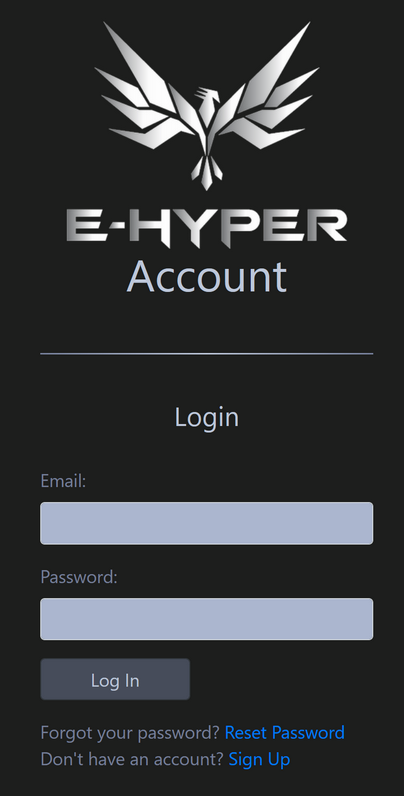

# Quickstart

## Getting started

### Step 1: Creating an E-HYPER Account

Navigate to https://auth.ea.e-hyper.com/register, fill in your primary email address and click "Register".

An activation email will be sent to the email.

### Step 2: Activate your E-HYPER Account

Check your email and click on the activation link in the email.

You will set your password during activation.

For security, you should use a strong and unique password.

### Step 3: RimoRomo App (if you are organisation owner)

If you plan to create organisation, for example, if you are the owner of your organisation, you need to activate the access to RimoRomo App.

If you are only operating Etatsu, you do not need to have access to RimoRomo App.

To activate access to RimoRomo App, navigate to https://app.rimoromo.com and login with your E-HYPER Account that you have created.

### Step 4: Login

Navigate to https://app.etatsu.com and login with your E-HYPER Account.

---

## Links
* [Home](../README.md)
* [Guide](./index.md)
