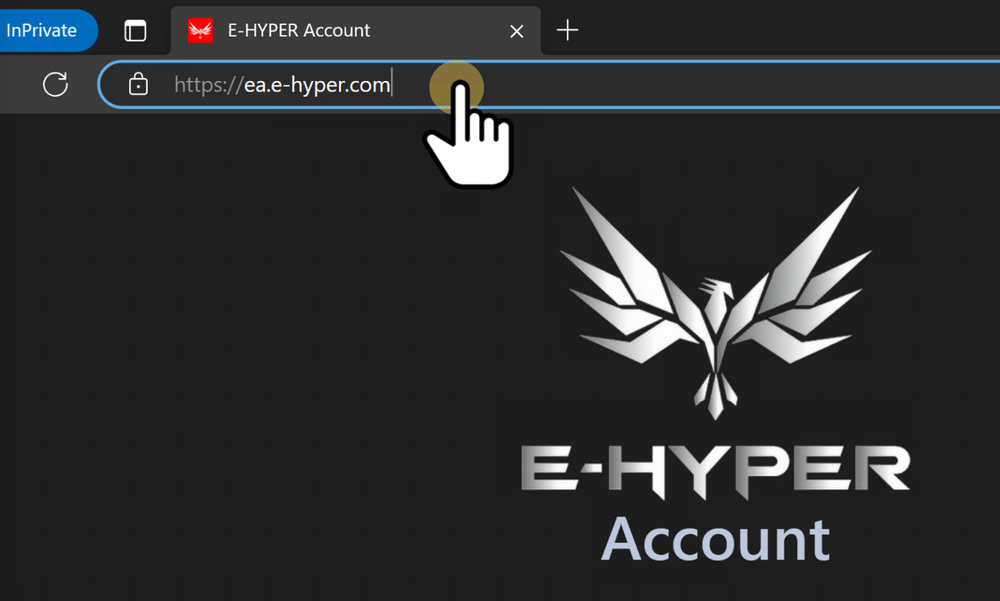
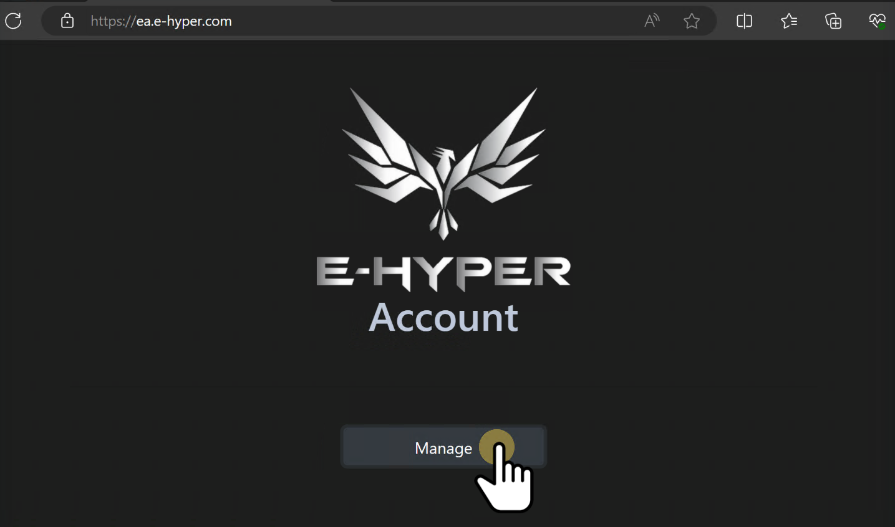
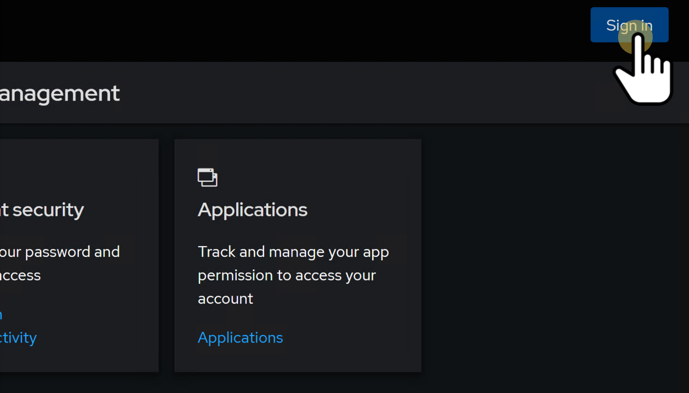
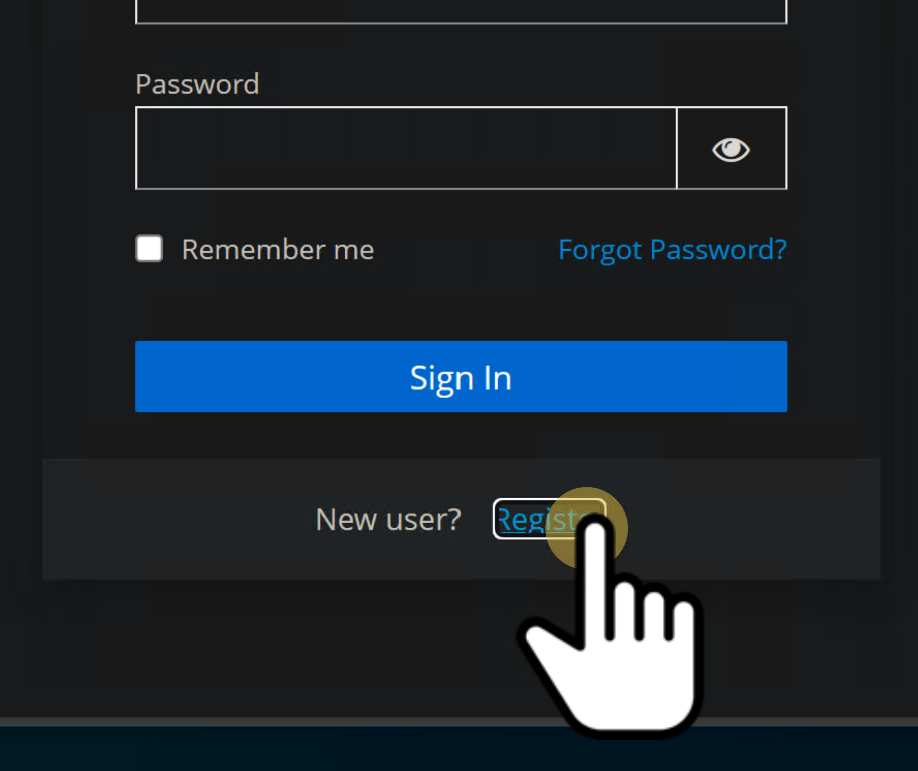
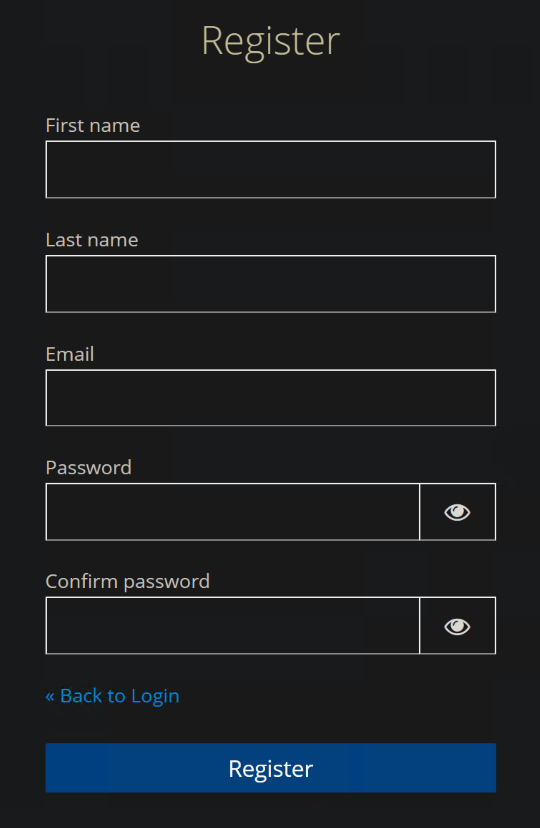
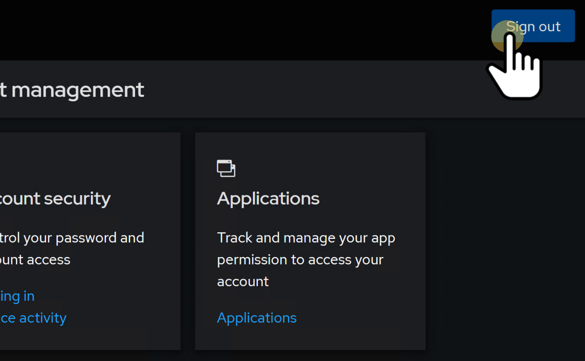
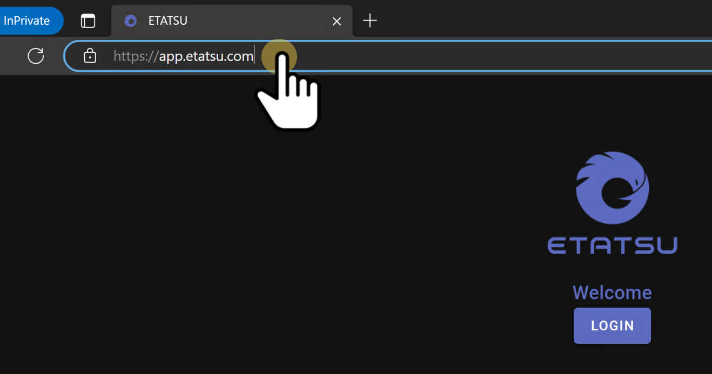
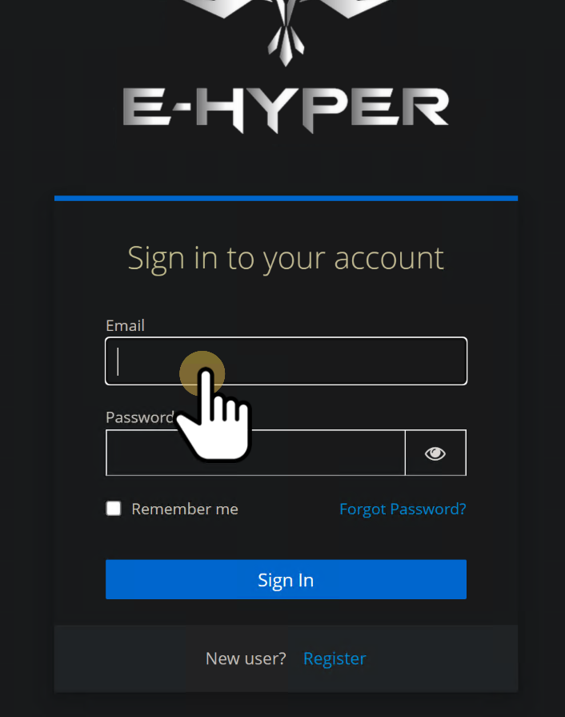

# Quickstart

## Getting started

### Step 1: Creating an E-HYPER Account

Navigate to https://ea.e-hyper.com.

Click **Manage**.

Click **Sign in**.

Click **Register**.

Fill in your names, primary email address and password.

For security, you should use a strong and unique password.

Click **Register**.

An activation email will be sent to your email.

Check your email and click on the activation link in the email.

You will be automatically signed in upon successful activation.

Click **Sign out** to logout.

### Step 2: RimoRomo App (if you are organisation owner)

If you plan to create organisation, for example, if you are the owner of your organisation, you need to activate the access to RimoRomo App.

If you are only operating Etatsu, you do not need to have access to RimoRomo App.

To activate access to RimoRomo App, navigate to https://app.rimoromo.com.

Login with your E-HYPER Account that you have created.

### Step 3: Login to Etatsu

Navigate to https://app.etatsu.com.

Login with your E-HYPER Account that you have created.

---

## Links

- [Home](../../README.md)
- [Guide](../index.md)
